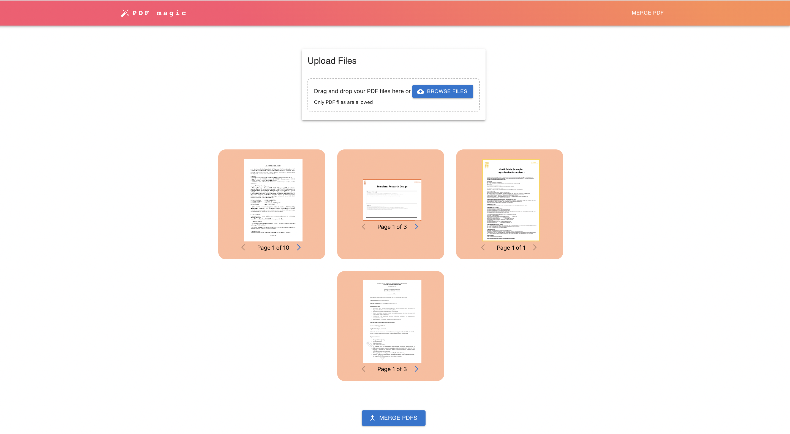

# PDF Magic



PDF Magic is an application that provides various PDF functionalities, such as merging PDFs and deleting pages. This README will guide you through the setup and usage of the application.

## Table of Contents

- [Features](#features)
- [Prerequisites](#prerequisites)
- [Installation](#installation)
- [Usage](#usage)

## Features

- Merge multiple PDF files into a single PDF.
- Delete specific pages from a PDF.

## Prerequisites

Before getting started with PDF Magic, make sure you have the following prerequisites installed on your system:

- Docker: [Install Docker](https://docs.docker.com/get-docker/)

## Installation

To install and set up PDF Magic, follow these steps:

1. Clone this repository to your local machine:

   ```shell
   git clone <repository-url>
   ```

2. Navigate to the project directory:

   ```shell
   cd pdf-magic
   ```

3. Build docker image:

   ```shell
   docker-compose build
   ```

4. Run the app:

   ```shell
   docker-compose up -d
   ```

## Usage

Currently the project supports merging of the pdfs.
